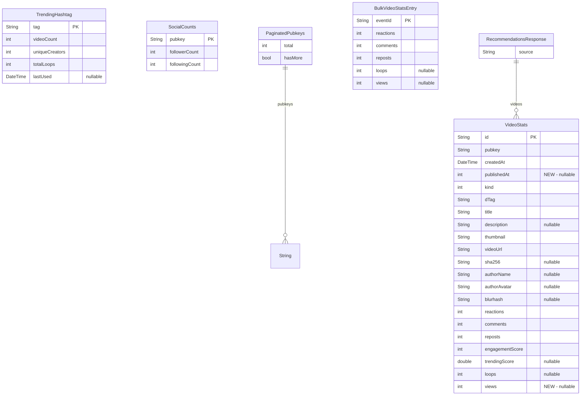

## Consolidate Funnelcake API Operations - Extensive Plan

## Overview

Merge all Funnelcake REST API operations from `lib/services/analytics_api_service.dart` into the `funnelcake_api_client` package and move shared models to the `models` package. This is an incremental migration -- Phase 1 enriches the package without touching consumers. Phases 2-6 progressively migrate consumers and eventually delete the legacy service.

## Problem Statement

Funnelcake HTTP operations are split across two locations:

1. **`packages/funnelcake_api_client/`** -- well-structured package with 6 methods, proper exceptions, and 1577 lines of tests. Used by `videos_repository` and `profile_repository`.
2. **`lib/services/analytics_api_service.dart`** -- monolithic 2400-line service with ~20 methods, in-memory caching, logging, model definitions, and `VideoStats -> VideoEvent` conversion. Used directly by 9 source files.

Problems:
- **Duplicate `VideoStats` class** -- the service defines its own version that shadows the `models` package version. They have incompatible fields (`publishedAt`/`views` vs `rawTags`).
- **Mixed concerns** -- the service combines HTTP calls, caching, domain conversion, and logging in one file.
- **No tests** -- the service has no unit tests; the package has comprehensive tests.
- **Inconsistent error handling** -- the package throws typed exceptions; the service swallows errors and returns empty lists.
- **5 overlapping methods** -- `getTrendingVideos`, `getRecentVideos`, `getHomeFeed`, `getVideosByAuthor`, `searchProfiles` exist in both.

## Proposed Solution

Incrementally consolidate all Funnelcake HTTP operations into `funnelcake_api_client` (pure HTTP client) and shared models into the `models` package. Domain repositories handle caching and conversion. The migration is split into 6 phases so each phase can be shipped independently without breaking anything.

## Technical Approach

### Architecture (Target State)

```
BLoCs/Providers
    |
    v
Domain Repositories (video_repo, profile_repo, hashtag_repo, etc.)
  - Caching logic
  - VideoStats -> VideoEvent conversion
  - Error handling / fallbacks
    |
    v
FunnelcakeApiClient (pure HTTP, throws exceptions)
    |
    v
models package (VideoStats, TrendingHashtag, SocialCounts, etc.)
```

### Implementation Phases

---

#### Phase 1: Foundation -- Enrich package and models (this plan)

No breaking changes. `analytics_api_service.dart` stays untouched. Duplication is accepted.

##### 1a. Add missing fields to `VideoStats` in models package

- **File:** `packages/models/lib/src/video_stats.dart`
- **Add fields:**
  - `publishedAt` (`int?`) -- Unix timestamp from `published_at` tag
  - `views` (`int?`) -- live view count from Funnelcake analytics
- **Update `fromJson`:** Parse `publishedAt` from tags, parse `views` using flexible key lookup (`views`, `view_count`, `total_views`, `unique_views`, `unique_viewers`)
- **Update `toVideoEvent`:** Use `publishedAt ?? (createdAt.millisecondsSinceEpoch ~/ 1000)` for effective timestamp; include `views` in `rawTags`
- **Update tests** in `packages/models/test/`

##### 1b. Create new models in the `models` package

Each model follows the existing pattern: `@immutable`, `const` constructor, `factory fromJson`, equality by primary key.

| Model | File | Key Fields |
|-------|------|------------|
| `TrendingHashtag` | `packages/models/lib/src/trending_hashtag.dart` | `tag`, `videoCount`, `uniqueCreators`, `totalLoops`, `lastUsed` |
| `SocialCounts` | `packages/models/lib/src/social_counts.dart` | `pubkey`, `followerCount`, `followingCount` |
| `PaginatedPubkeys` | `packages/models/lib/src/paginated_pubkeys.dart` | `pubkeys`, `total`, `hasMore` |
| `BulkVideoStatsEntry` | `packages/models/lib/src/bulk_video_stats_entry.dart` | `eventId`, `reactions`, `comments`, `reposts`, `loops`, `views` |

- **Export** each from `packages/models/lib/models.dart` barrel file
- **Write tests** for each model's `fromJson` in `packages/models/test/`

##### 1c. Create response models in the `models` package

All response wrappers live alongside domain models for simpler imports and reduced cognitive overhead.

| Model | File | Purpose |
|-------|------|---------|
| `RecommendationsResponse` | `packages/models/lib/src/recommendations_response.dart` | Wraps videos + source attribution |
| `BulkVideoStatsResponse` | `packages/models/lib/src/bulk_video_stats_response.dart` | Wraps map of eventId -> stats |
| `BulkProfilesResponse` | `packages/models/lib/src/bulk_profiles_response.dart` | Wraps map of pubkey -> profile data |
| `VideoViewsResponse` | `packages/models/lib/src/video_views_response.dart` | Wraps view count for single video |
| `HomeFeedResponse` | `packages/models/lib/src/home_feed_response.dart` | **Move** from `funnelcake_api_client/lib/src/models/` for consistency |

- **Export** each from `packages/models/lib/models.dart` barrel file
- **Update** `funnelcake_api_client` to import `HomeFeedResponse` from the `models` package instead of its local copy
- **Delete** `funnelcake_api_client/lib/src/models/` directory after move

##### 1d. Add `_post` helper to `FunnelcakeApiClient`

Mirror the existing `_get` helper but for POST requests. Include `Content-Type: application/json` header alongside the existing `Accept` and `User-Agent` headers. Use `jsonEncode` for the body and apply the same `_timeout`.

##### 1e. Fix `getCollabVideos` to use `_get` helper

- **File:** `packages/funnelcake_api_client/lib/src/funnelcake_api_client.dart`
- **Issue:** Method inlines HTTP call instead of using `_get`
- **Fix:** Refactor to use `_get(uri)` like all other GET methods

##### 1f. Add missing HTTP methods to `FunnelcakeApiClient`

All methods follow the established pattern: guard checks, build URI, try/catch with typed exceptions, filter invalid results.

**Simple GET methods (return `List<VideoStats>`):**

| Method | Endpoint | Query Params |
|--------|----------|--------------|
| `getVideosByLoops` | `/api/videos` | `sort=loops`, `limit`, `before` |
| `getVideosByHashtag` | `/api/videos` | `tag={hashtag}`, `sort=trending`, `limit`, `before` |
| `getClassicVideosByHashtag` | `/api/videos` | `tag={hashtag}`, `sort=loops`, `limit` |
| `searchVideos` | `/api/search` | `q={query}`, `limit` |
| `getClassicVines` | `/api/videos` | `classic=true`, `platform=vine`, `sort`, `limit`, `offset`/`before` |
| `fetchTrendingHashtags` | `/api/hashtags` | `limit` -- returns `List<TrendingHashtag>` |

**Single-resource GET methods:**

| Method | Endpoint | Returns |
|--------|----------|---------|
| `getVideoStats` | `/api/videos/{id}/stats` | `VideoStats?` (null on 404) |
| `getVideoViews` | `/api/videos/{id}/views` | `VideoViewsResponse` |
| `getUserProfile` | `/api/users/{pubkey}` | `Map<String, dynamic>?` (profile data or null) |
| `getSocialCounts` | `/api/users/{pubkey}/social` | `SocialCounts` |
| `getFollowers` | `/api/users/{pubkey}/followers` | `PaginatedPubkeys` |
| `getFollowing` | `/api/users/{pubkey}/following` | `PaginatedPubkeys` |
| `getRecommendations` | `/api/users/{pubkey}/recommendations` | `RecommendationsResponse` |

**POST methods (bulk operations):**

| Method | Endpoint | Body | Returns |
|--------|----------|------|---------|
| `getBulkProfiles` | `POST /api/users/bulk` | `{"pubkeys": [...]}` | `BulkProfilesResponse` |
| `getBulkVideoStats` | `POST /api/videos/stats/bulk` | `{"event_ids": [...]}` | `BulkVideoStatsResponse` |

**Note:** `getBulkVideoViews` and `getClassicVinesPage` from the service are thin wrappers (fan-out/offset calculation). These belong in the repository layer, not the client.

##### 1g. Write tests for all new methods

Follow established test pattern for each method (~8-12 tests each):
1. Happy path (response parsing)
2. URL construction verification
3. Optional parameter handling
4. Filtering behavior (empty id/url)
5. Not configured exception
6. Empty input exception (where applicable)
7. 404 handling
8. Server error handling
9. Timeout handling
10. Network error handling

**Estimated new test count:** ~14 methods x ~10 tests = ~140 new tests

##### Phase 1 Success Criteria

- [ ] `VideoStats` in models has `publishedAt` and `views` fields
- [ ] `VideoStats.toVideoEvent()` uses `publishedAt` for effective timestamp
- [ ] 4 new models in `models` package with tests
- [ ] 4 new response models in `models` package
- [ ] `HomeFeedResponse` moved from `funnelcake_api_client` to `models` package
- [ ] `_post` helper added to client
- [ ] `getCollabVideos` uses `_get` helper
- [ ] ~14 new HTTP methods in `FunnelcakeApiClient` with tests
- [ ] All existing tests still pass
- [ ] `dart analyze` clean on both packages

---

#### Phase 2: Migrate video feed consumers

Migrate `popular_videos_feed_provider.dart`, `home_feed_provider.dart`, and video-related providers in `curation_providers.dart` to use `videos_repository` (which already consumes `FunnelcakeApiClient`).

**Methods to migrate:**
- `getTrendingVideos`, `getRecentVideos`, `getHomeFeed`
- `getBulkVideoStats`, `getBulkVideoViews`

**Consumer files:**
- `lib/providers/popular_videos_feed_provider.dart`
- `lib/providers/home_feed_provider.dart`
- `lib/providers/curation_providers.dart` — `FunnelcakeAvailable` (uses `getRecentVideos`), `AnalyticsTrending` and `AnalyticsPopular` (use `getTrendingVideos`)

**Caching moves to:** `videos_repository`

---

#### Phase 3: Migrate curation hashtag consumers

Migrate hashtag-related providers in `curation_providers.dart` to use `HashtagRepository` (already exists at `packages/hashtag_repository/`).

**Methods to migrate:**
- `getTrendingHashtags` and `fetchTrendingHashtags` → consolidate into single `getTrendingHashtags({bool forceRefresh, int limit})` on `HashtagRepository`. The repository handles caching internally.

**Target repository:** `HashtagRepository` (`packages/hashtag_repository/`)

**Note:** `FunnelcakeAvailable` provider (availability probe using `getRecentVideos`) and `AnalyticsTrending`/`AnalyticsPopular` providers (using `getTrendingVideos`) belong in Phase 2 since they use video-domain methods via `VideosRepository`.

---

#### Phase 4: Migrate profile and social consumers

Migrate `social_service.dart` and `user_profile_service.dart` to use `profile_repository`. Migrate follower/following data to `FollowRepository`.

**Methods to migrate:**
- `getSocialCounts`, `getUserProfile`, `getBulkProfiles` → `profile_repository`
- `getFollowers`, `getFollowing` → `FollowRepository` (already exists at `lib/repositories/follow_repository.dart` with follower methods and Funnelcake callback injections in `app_providers.dart`)

**Migration approach for followers/following:** Replace the callback injections in `app_providers.dart` (`fetchFollowingFromApi`, `fetchFollowersFromApi`) with direct `FunnelcakeApiClient` dependency on `FollowRepository`. This aligns with layered architecture (Repository → Client).

**Caching moves to:** `profile_repository` (profile/social), `FollowRepository` (followers/following)

---

#### Phase 5: Migrate creator analytics

Migrate `creator_analytics_repository.dart` (already a repository wrapper).

**Methods to migrate:**
- `getVideosByAuthor`, `getBulkVideoStats`, `getVideoViews`, `getSocialCounts`

---

#### Phase 6: Cleanup

- Remove `AnalyticsApiService` instantiation from `app_providers.dart`
- Delete `lib/services/analytics_api_service.dart`
- Delete associated test file
- Remove unused imports from all files

---

## Alternative Approaches Considered

1. **Everything in one package (SDK style)** -- Put HTTP, caching, models, and conversion all in `funnelcake_api_client`. Rejected: mixes concerns, harder to test, violates layered architecture.

2. **Big-bang migration** -- Delete `analytics_api_service.dart` in one PR, update all 21 files. Rejected: too risky, large blast radius, hard to review.

3. **Create a funnelcake_repository** -- Single repository wrapping the client. Rejected by user: domain repositories (video, profile, hashtag) are the right abstraction, not a funnelcake-specific one.

## Acceptance Criteria

### Functional Requirements (Phase 1)

- [ ] Every Funnelcake REST API endpoint has a corresponding method in `FunnelcakeApiClient`
- [ ] All shared models are in the `models` package with `fromJson` factories
- [ ] Response models are in the `models` package
- [ ] All methods throw typed exceptions on failure (not swallow errors)
- [ ] All methods filter invalid results (empty id, empty videoUrl, empty pubkey)

### Non-Functional Requirements

- [ ] No caching in the client (repository responsibility)
- [ ] No logging in the client (pure data layer)
- [ ] No `VideoEvent` conversion in the client (repository responsibility)
- [ ] No Flutter SDK dependencies in either package

### Quality Gates

- [ ] 100% test coverage on new code
- [ ] `very_good_analysis` lint rules pass
- [ ] `dart analyze` clean
- [ ] Existing tests unchanged and passing
- [ ] No consumer changes (Phase 1 is additive only)

## Dependencies and Prerequisites

- None for Phase 1 -- it is purely additive
- Phases 2-6 depend on Phase 1 completion
- Phases 2-5 are independent of each other (can be done in any order)
- Phase 6 depends on all of Phases 2-5

## Risk Analysis and Mitigation

| Risk | Impact | Mitigation |
|------|--------|------------|
| `VideoStats.fromJson` parsing divergence | Methods return different data than service | Port the flexible `findIntDeep` parsing logic to a shared utility in the `models` package (used by both `VideoStats.fromJson` and `BulkVideoStatsEntry.fromJson`) |
| `toVideoEvent()` behavior change after adding `publishedAt` | **High risk.** `videos_repository` and `profile_repository` already call `toVideoEvent()`. Changing timestamp logic silently affects production behavior. | Run existing `videos_repository` and `profile_repository` tests before and after the change. Write targeted tests comparing old vs new output for the same input JSON to confirm parity. |
| Package dependency conflicts | Build failures | Run `dart pub get` and `dart analyze` after each model addition |
| Temporary duplication confuses contributors | Wrong method called | Document in PR description that duplication is intentional and temporary |

## Affected Files (Phase 1)

| File | Action | Description |
|------|--------|-------------|
| `packages/models/lib/src/video_stats.dart` | Modify | Add `publishedAt`, `views` fields; update `fromJson` and `toVideoEvent` |
| `packages/models/lib/src/trending_hashtag.dart` | Create | New model |
| `packages/models/lib/src/social_counts.dart` | Create | New model |
| `packages/models/lib/src/paginated_pubkeys.dart` | Create | New model |
| `packages/models/lib/src/bulk_video_stats_entry.dart` | Create | New model |
| `packages/models/lib/models.dart` | Modify | Export new models |
| `packages/models/test/src/trending_hashtag_test.dart` | Create | Tests |
| `packages/models/test/src/social_counts_test.dart` | Create | Tests |
| `packages/models/test/src/paginated_pubkeys_test.dart` | Create | Tests |
| `packages/models/test/src/bulk_video_stats_entry_test.dart` | Create | Tests |
| `packages/models/test/src/video_stats_test.dart` | Modify | Test new fields |
| `packages/models/lib/src/recommendations_response.dart` | Create | Response model |
| `packages/models/lib/src/bulk_video_stats_response.dart` | Create | Response model |
| `packages/models/lib/src/bulk_profiles_response.dart` | Create | Response model |
| `packages/models/lib/src/video_views_response.dart` | Create | Response model |
| `packages/models/lib/src/home_feed_response.dart` | Move | From `funnelcake_api_client/lib/src/models/` |
| `packages/models/test/src/recommendations_response_test.dart` | Create | Tests |
| `packages/models/test/src/bulk_video_stats_response_test.dart` | Create | Tests |
| `packages/models/test/src/bulk_profiles_response_test.dart` | Create | Tests |
| `packages/models/test/src/video_views_response_test.dart` | Create | Tests |
| `packages/models/test/src/home_feed_response_test.dart` | Create | Tests |
| `packages/funnelcake_api_client/lib/src/funnelcake_api_client.dart` | Modify | Add `_post` helper + ~14 new methods; fix `getCollabVideos`; import `HomeFeedResponse` from models |
| `packages/funnelcake_api_client/lib/src/models/` | Delete | Directory removed after `HomeFeedResponse` moves |
| `packages/funnelcake_api_client/lib/funnelcake_api_client.dart` | Modify | Update barrel to remove local models export, add models dependency |
| `packages/funnelcake_api_client/test/src/funnelcake_api_client_test.dart` | Modify | Add ~140 new tests |

## ERD: New Models



## References

### Internal References

- Client pattern: `packages/funnelcake_api_client/lib/src/funnelcake_api_client.dart`
- Exception pattern: `packages/funnelcake_api_client/lib/src/exceptions.dart`
- Model pattern: `packages/models/lib/src/video_stats.dart`
- Test pattern: `packages/funnelcake_api_client/test/src/funnelcake_api_client_test.dart`
- Source of methods to port: `lib/services/analytics_api_service.dart`
- Funnelcake API docs: `docs/FUNNELCAKE_API_REFERENCE.md`

### Consumer Files (for Phases 2-6 reference)

- `lib/providers/app_providers.dart` -- Phase 6
- `lib/services/social_service.dart` -- Phase 4
- `lib/services/user_profile_service.dart` -- Phase 4
- `lib/screens/creator_analytics_screen.dart` -- Phase 5
- `lib/providers/popular_videos_feed_provider.dart` -- Phase 2
- `lib/providers/home_feed_provider.dart` -- Phase 2
- `lib/providers/curation_providers.dart` -- Phase 2 (video providers: `FunnelcakeAvailable`, `AnalyticsTrending`, `AnalyticsPopular`) and Phase 3 (hashtag providers)
- `lib/providers/creator_analytics_providers.dart` -- Phase 5
- `lib/features/creator_analytics/creator_analytics_repository.dart` -- Phase 5
